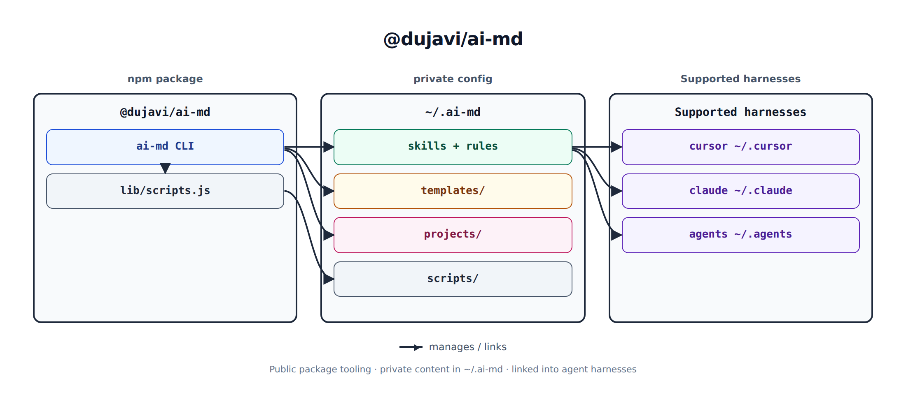
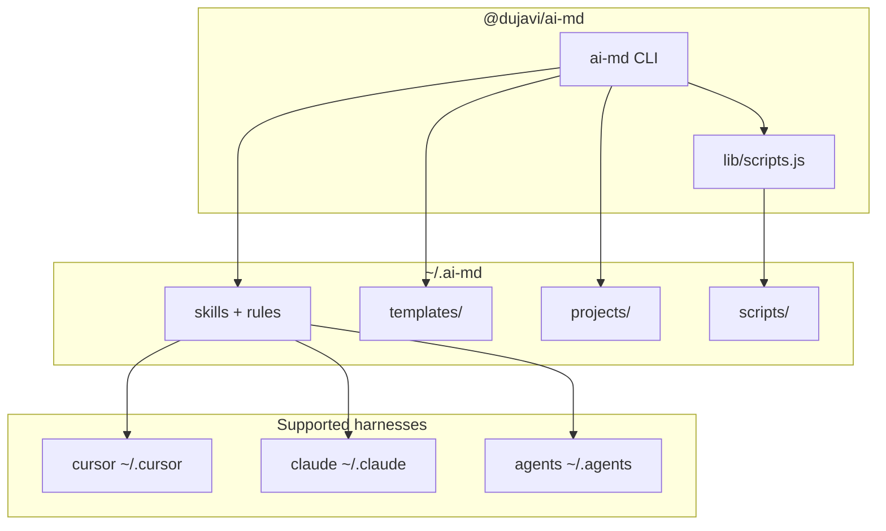

# @dujavi/ai-md

Public **AXI-shaped** CLI for a **private** personal AI config directory (`~/.ai-md`).

The npm package ships tooling only — no personal skills, rules, or secrets. Your content lives in a private git repo you point at with `--remote` (or machine config). Default reads are TOON + `help[]`; use `--json` when you need JSON.



## What it manages

| Layer | Path | Purpose |
|-------|------|---------|
| **System** | `skills/`, `rules/` | Global base — linked into agent harnesses |
| **Templates** | `templates/<type>/` | Project-type starters (`base`, later `forms`, …) |
| **Projects** | `projects/<name>/` | Per-app overlays (repo `.cursor` → here) |
| **Scripts** | `scripts/<name>` | Private machine scripts via `ai-md script` / `setup --script` |

## Supported harnesses

Skill (and for Cursor, rules) link targets via `--agents` (comma-separated):

| Harness | Skills link | Notes |
|---------|-------------|--------|
| `cursor` | `~/.cursor/skills` | **Default.** Install also links `~/.cursor/rules` → `~/.ai-md/rules` |
| `claude` | `~/.claude/skills` | Optional second harness |
| `agents` | `~/.agents/skills` | Optional agents-skills layout |

```bash
ai-md doctor --fix --agents cursor,claude
ai-md install --agents cursor,claude,agents
```

## Architecture



Personal installers (Grok, quota-axi, etc.) are **not** baked into this package. Put them in `~/.ai-md/scripts/` and run with `--script` / `ai-md script`.

## Quick start

```bash
npm i -g @dujavi/ai-md

# First machine: persist config, clone, link, run a private script
ai-md setup --remote https://github.com/<you>/.ai-md.git --script ensure-tools

# Or step by step
ai-md config set --remote https://github.com/<you>/.ai-md.git --dir ~/.ai-md
ai-md install
ai-md script ensure-tools
```

Precedence: `--remote` / `--dir` flags > `AI_MD_*` env > `~/.config/ai-md/config.json` > defaults (`~/.ai-md`, package default remote).

## Commands

```bash
ai-md                                      # status (AXI)
ai-md setup --remote <url> --script <name>
ai-md config | config set --remote <url> --dir ~/.ai-md
ai-md install [--agents cursor,claude]
ai-md doctor --fix
ai-md pull | push -m "why"
ai-md script <name> [--] [args...]         # private ~/.ai-md/scripts/
ai-md init-project --repo ~/app --from base
ai-md apply-template --project app --from base
ai-md link-project --repo ~/app --name app
```

### Private scripts

```bash
ai-md script ensure-tools
ai-md script ensure-tools -- --dry-run
ai-md setup --remote <url> --script ensure-tools -- --dry-run
```

- Resolves `$AI_MD_DIR/scripts/<name>` or `<name>.sh` (basename only; no `..` / paths).
- Args after the script name (or after `--` on `setup` / `install`) are forwarded unchanged.
- Repeat `--script` on setup/install; the same trailing args apply to each.

## Machine config

Persisted at `~/.config/ai-md/config.json` (override path with `AI_MD_CONFIG`):

```json
{ "dir": "/home/you/.ai-md", "remote": "https://github.com/you/.ai-md.git" }
```

Env one-shots: `AI_MD_DIR`, `AI_MD_REMOTE`.

## Layout example

```text
~/.ai-md/
  skills/                 # system — harnesses see these
  rules/
  scripts/
    ensure-tools.sh       # your private tooling
  templates/
    base/
  projects/
    my-app/
```

## License

MIT
